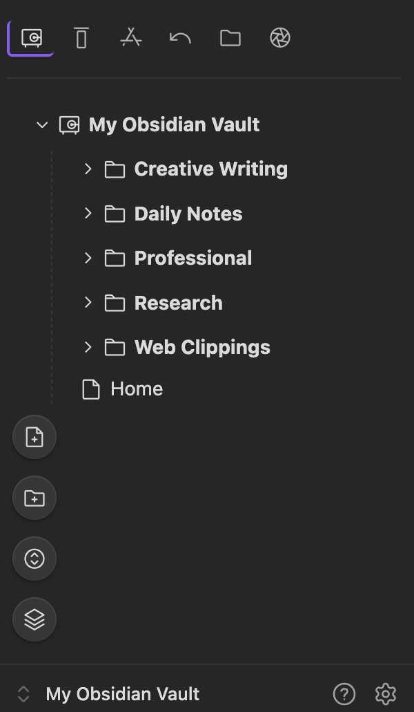
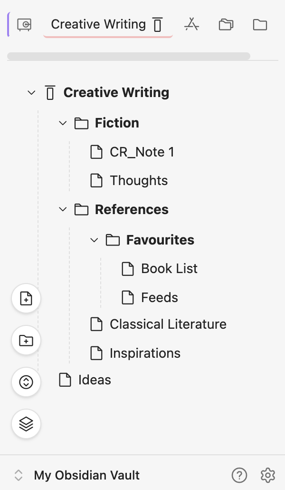
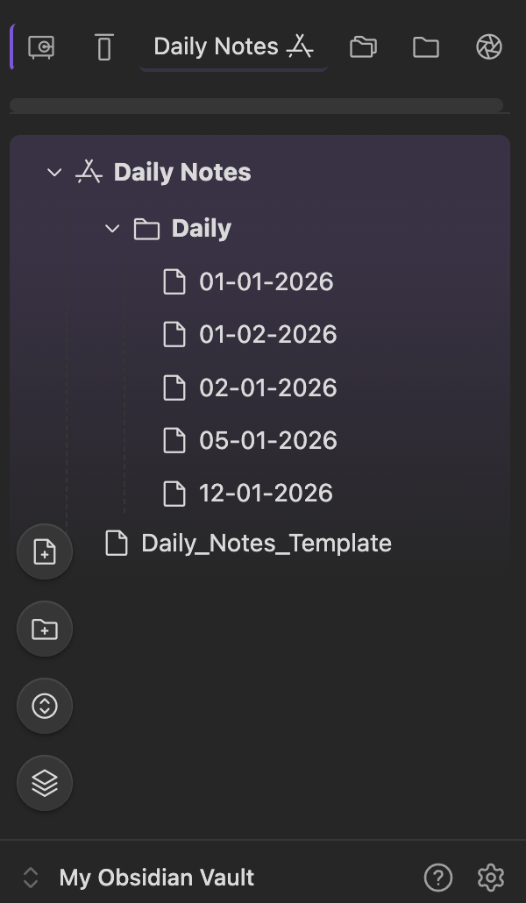
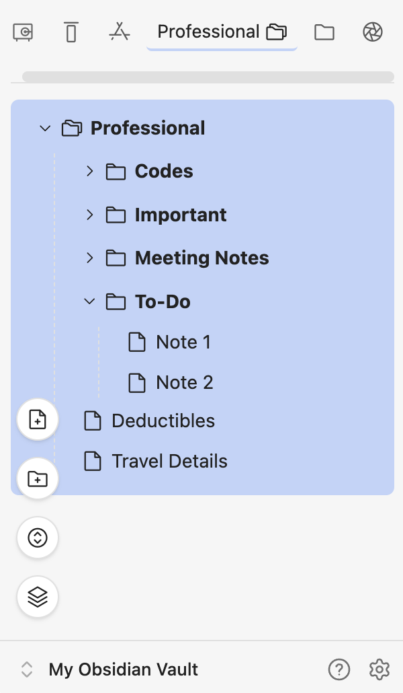
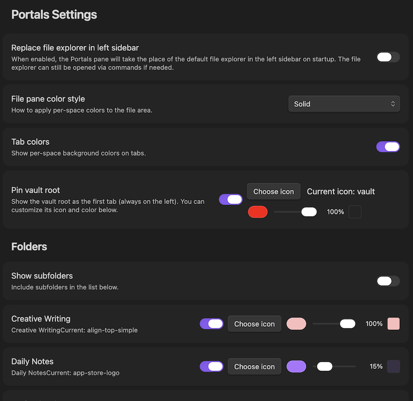
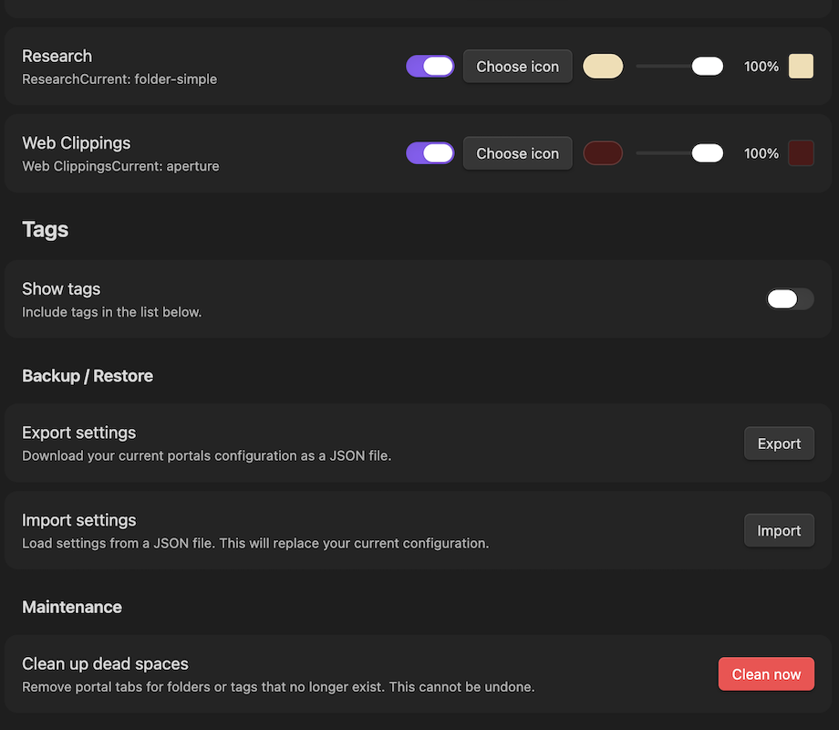

# Portals for Obsidian

  

Portals enhances your Obsidian file navigation by letting you pin any folder or tag as a **customizable tab**, a Portal into your selected folder trees. Add icons to Tabs, background colors, gradients and rearrange them to suit your workflow.

  

## Screenshots

  













  

## ✨ Features

  
  
  

- **Pin any folder or tag** – Turn your most‑used folders and tags into tabs at the top of the file pane.

  

- **Custom icons & colors** – Choose from hundreds of icons from the Phosphor set for the Tabs and set any background color with an opacity slider. There is an option to use gradients. Control the colors of Tabs and File Pane separately.

  

- **Full file tree** – Expand/collapse folders, drag‑and‑drop files and folders to move them.

  

- **Complete context menus** – Right‑click files or folders to get the same menu as the default file explorer.

  

- **Floating action buttons** – Quick‑create notes, folders, collapse all subfolders and change sort order.

  

- **Native Sorting** – Choose how files are sorted (by name, creation time, or modification time, ascending/descending). Your choice is saved between sessions.

  

- **Safe deletion** – Files are moved to Obsidian’s .trash folder – no permanent deletion without confirmation. Works well with Trash Explorer Plugin

  

- **Mobile friendly** – Responsive design that works on small screens. Tested on android as of now.

  

- **Export/Import settings** – Backup your tab configuration or transfer it to another vault.

  

## ⚙️ Installation

> [!CAUTION]
> Before updating plugin version, **export your current settings** using the Backup/Restore option in Portals settings. This ensures you can restore your configuration if anything goes wrong.

### Using BRAT (Beta Reviewers Auto-update Tester)

1. Install the **BRAT** plugin from the Obsidian community plugins (if you haven’t already).
    
2. Open BRAT settings and click **Add Beta plugin**.
    
3. Enter the repository URL: `https://github.com/samaraliwarsi/obsidian-portals`.
    
4. Click **Add Plugin** – BRAT will download and enable the latest release.


### Manual installation

1. Download the latest release from the [releases page](https://github.com/samaraliwarsi/obsidian-portals/releases).

  

2. Extract the files into your vault’s `.obsidian/plugins/obsidian-portals/` folder.

  

3. Enable the plugin in Obsidian settings.

  

  

## 🚀 Usage

  

  

### Creating a tab

  

- Open **Settings → Portals**.

  

- Under **Folders** or **Tags**, toggle on any folder/tag you want to appear as a tab. For subfolders or tags to show up, you have to enable that toggle in settings. By default the plugin works with root folders inside the vault.

  

- Optionally, click **Choose icon** to pick an icon from the Phosphor library, and use the color picker + opacity slider to set a background color.

  

- Option to have the entire Vault as a Portal Tab. Note that this stays pinned to the left of Tab Bar.

  

  

### Managing tabs

  

- Drag tabs left/right to reorder.

  

- The active tab is highlighted and shows the folder/tag name.

  

- Hover over an inactive tab to see a tooltip with its name.

  

  

### Floating action buttons

  

Four buttons appear at the bottom‑left of the file pane:

  

- **New note**  – creates an untitled note in the current folder tab.

  

- **New folder** – creates a new folder in the current folder tab.

  

- **Sort** – opens a menu to change the sort order (Name A→Z / Z→A, Created oldest/newest, Modified oldest/newest). The choice is saved.

  

- **Collapse all**  – collapses all subfolders while keeping the current tab’s root folder expanded.


### Drag & drop

  

- Drag files onto folders to move them. This is not supported on mobile. Dragging between Portal Tabs is not possible. Use context menu 'Move to' to move files/ folders between portals. 

## ⚙️ Settings

  

  

- **Replace file explorer** – If enabled, Portals will open in the left sidebar on startup (the original file explorer is still there on a different tab of left sidebar).

  

- **File pane color style** – Choose how tab background colors are applied: **Gradient** (fades from solid to transparent), **Solid**, or **None**.

  

- **Tab colors** – Toggle whether tabs use their assigned background color.

  

- **Pin vault root** – Pins the vault root as the first tab (always on the left). You can customize its icon and color separately.

  

- **Sort defaults** – Choose the default sort method and order for new vaults (users can still change it via the floating button).

  

- **Backup / Restore** – Export your entire settings to a JSON file, or import from a previously saved file.


- Clean up Dead Tabs - If you delete a folder that was assigned as a Portal Tab, use settings to clean up the remnants from the display. 

  

  

## 🧑‍💻 Development

  

  

Clone the repository, install dependencies, and build:

  

  

```bash

  

git clone https://github.com/samaraliwarsi/obsidian-portals.git

  

cd obsidian-portals

  

npm install

  

npm run build

  

```

  

  

The built `main.js` and `styles.css` will be in the root folder. Copy them into your test vault’s `.obsidian/plugins/obsidian-portals/` directory.
  

## 📝 License

  
  

This project is licensed under the MIT License. See the [LICENSE](LICENSE) file for details.

  

---

_Built with assistance from AI (vibe coded)._

---