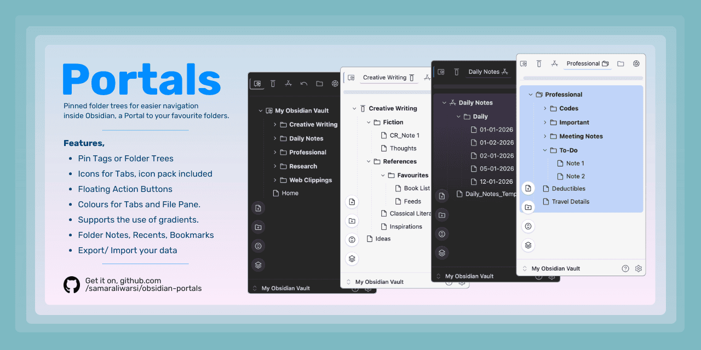
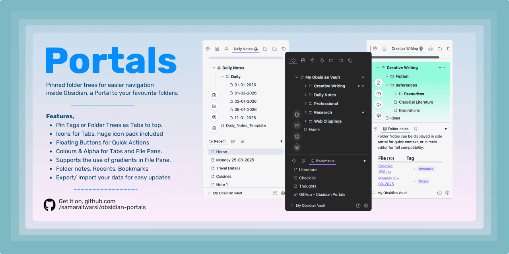

# Portals for Obsidian

Portals enhances your Obsidian file navigation by letting you pin any folder or tag as a **customizable tab**, a Portal into your selected folder trees. Add icons to Tabs, background colors, gradients and rearrange them to suit your workflow.
## Screenshots

 


  
## ✨ Features

- **Pin any folder or tag** – Turn your most‑used folders and tags into tabs at the top of the file pane.
- **Custom icons & colors** – Choose from hundreds of icons from the Phosphor set for the tabs and set any background color with an opacity slider. Option to use gradients. Control tab and file pane colors separately.
- **Full file tree** – Expand/collapse folders, drag‑and‑drop files and folders to move them.
- **Complete context menus** – Right‑click files or folders to get the same menu as the default file explorer.
- **Floating action buttons** – Quick‑create notes, folders, collapse all subfolders, and change sort order.
- **Native sorting** – Choose how files are sorted (by name, creation time, or modification time, ascending/descending). Your choice is saved between sessions.
- **Side Portal** - A modular, collapsable, resizable pane for new views and more ways to access content. Toggle it on in settings to find options inside. **Side Portal** has tabs containing,  **Bookmarks**, **Recent Files** and **Folder Notes**. To use **Side Portal,** at least one tab is required to be on in settings. 
- **Folder Notes** – Each folder can have an associated note (markdown file with the same name). The note can be displayed in a side panel, and folders with a note are marked with a small dot. Global toggle to enable/disable folder notes. Folders with **Folder Notes** are highlighted with a grey dot. **Folder notes** can be used without side portal as well.
- **Recents** - Live update recent files list from across the vault. 
- **Bookmarks** - Bookmark your favourite files or web links from Obsidian web viewer.
- **Safe deletion** – Files are moved to Obsidian’s `.trash` folder – no permanent deletion without confirmation. Works well with Trash Explorer Plugin.
- **Mobile friendly** – Responsive design that works on small screens. Tested on Android (more platforms coming).
- **Export/Import settings** – Backup your tab configuration or transfer it to another vault.
>[!TIP]
> If you'd like a starting point for your folder notes, you can find a [Sample_FolderNote](templates/Sample_FolderNote.md) and a [Guide](templates/Portals%20Folder-Notes%20Guide.md) in the [templates](templates) folder. Just copy it to your vault and rename it as needed.

## ⚙️ Installation
### Using BRAT (Beta Reviewers Auto-update Tester)

1. Install the **BRAT** plugin from the Obsidian community plugins (if you haven’t already).
2. Open BRAT settings and click **Add Beta plugin**.
3. Enter the repository URL: `https://github.com/samaraliwarsi/obsidian-portals`.
4. Click **Add Plugin** – BRAT will download and enable the latest release.
### Manual installation

1. Download the latest release from the [releases page](https://github.com/samaraliwarsi/obsidian-portals/releases).
2. Extract the files into your vault’s `.obsidian/plugins/obsidian-portals/` folder.
3. Enable the plugin in Obsidian settings.
## 🚀 Usage
### Creating a tab

- Open **Settings → Portals**.
- Under **Folders** or **Tags**, toggle on any folder/tag you want to appear as a tab. For subfolders or tags to show up, you have to enable that toggle in settings. By default the plugin works with root folders inside the vault.
- Optionally, click **Choose icon** to pick an icon from the Phosphor library, and use the color picker + opacity slider to set a background color.
- You can also pin the entire vault as a Portal Tab – it stays pinned to the left of the tab bar.
### Managing tabs

- Drag tabs left/right to reorder.
- The active tab is highlighted and shows the folder/tag name.
- Hover over an inactive tab to see a tooltip with its name.
- For **Side Portal** choose the tabs you want in settings.
### Folder Notes
- Each folder can have an associated **folder note** – a markdown file with the same name as the folder (case‑insensitive).  
- For non‑root folders, use the folder’s context menu to **Create folder note** or **Open folder note**.
- For the vault root, and also for any folder, create a note manually with the same name as your vault (e.g., `MyVault.md`). The root folder note is not created automatically via context menu.
- The **Folder Notes** side portal (bottom of the file pane) displays the content of the folder note for the currently active portal.
- A small dot appears next to any folder that has a folder note (including the root).
- **Cmd/Ctrl + click** on a folder (in the tree) opens its folder note in a new editor tab.
- Settings let you globally enable/disable folder notes and control whether they appear in the file tree.
### Floating action buttons

Four buttons appear at the bottom‑left of the file panel.  
- **New note** – creates an untitled note in the current folder tab.
- **New folder** – creates a new folder in the current folder tab.
- **Sort** – opens a menu to change the sort order (Name A→Z / Z→A, Created oldest/newest, Modified oldest/newest). The choice is saved.
- **Collapse all** – collapses all subfolders while keeping the current tab’s root folder expanded.
### Drag & drop

- Drag files onto folders to move them. This is not supported only on desktop. Use context menu 'Move to' to move files/ folders between portals on other devices.
### Accesiblitiy

- Recent Files, Bookmarks to improve file access. 

## ⚙️ Settings

- **Replace file explorer** – If enabled, Portals will open in the left sidebar on startup (the original file explorer is still there on a different tab of left sidebar).
- **File pane color style** – Choose how tab background colors are applied: **Gradient** (fades from solid to transparent), **Solid**, or **None**.
- **Tab colors** – Toggle whether tabs use their assigned background color.
- **Enable folder notes** – Global toggle for the folder notes feature. When disabled, folder notes are treated as normal files (always visible), the side panel shows a notice, and folder‑note context menu items are removed.
- **Show folder notes in file tree** – When folder notes are enabled, this controls whether they appear in the tree. If disabled, they are hidden.
- **Pin vault root** – Pins the vault root as the first tab (always on the left). You can customize its icon and color separately.
- **Sort defaults** – Choose the default sort method and order for new vaults (users can still change it via the floating button).
- **Side Portal** – Enable or disable the bottom panel with additional tabs (Recent, Folder Notes, Bookmarks). You can also choose which tabs appear.
- **Backup / Restore** – Export your entire settings to a JSON file, or import from a previously saved file.
- **Clean up Dead Portals** - If you delete a folder that was assigned as a Portal Tab, use settings to clean up the remnants from the display.
## 🧑‍💻 Development

Clone the repository, install dependencies, and build:

```bash
git clone https://github.com/samaraliwarsi/obsidian-portals.git
cd obsidian-portals
npm install
npm run build
```

The built `main.js` and `styles.css` will be in the root folder. Copy them into your test vault’s `.obsidian/plugins/obsidian-portals/` directory.
## 📝 License

This project is licensed under the MIT License. See the [LICENSE](LICENSE) file for details.

---
